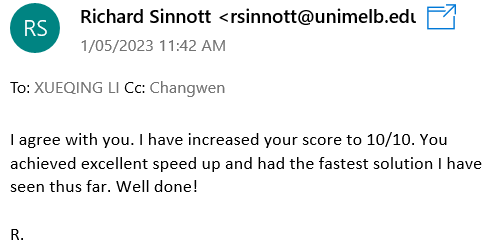

# COMP90024CCC-Assignment1-large-tweet-analysis
### Brief Intro: 
This project analyzes a huge Twitter file (more than 50GB, available on UniMelb Spartan) in a parallel manner with MPI. 
This project obtains full marks. According to Prof Richard, our project is the fastest solution. 

### For the details (how to execute the code, the architecture and technical details), refer to the [project report](https://github.com/ArthurLCW/COMP90024CCC-Assignment1-large-tweet-analysis/blob/main/a1-report.pdf)
